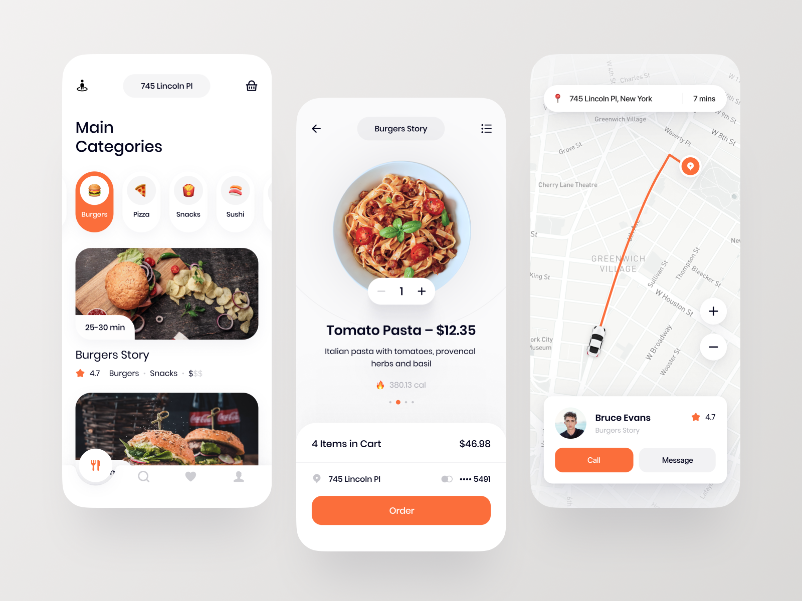

# FoodDeliveryApp

> A beautiful food delivery app for use in online food commerce just like UberEats

## Features

- Restaurants Listing
- Food Listing depending on category selected
- Adding to cart
- Auth
- Routing & Directions
- [Pending] Order Tracking
- [Pending] Admin Panel
- [Pending] Admin - Vendor - Customer Synching
- [Pending] Payment Gateways intergration
- [Pending] Push Notifications

## Coupled Apps

- <a> _[Coming Soon]_ Admin Panel (Web App / Electron App)</a>
- <a> Rider App </a>
- <a> Vendor App </a>

## User Interface

## Languages

- **Node.js & Express** => _For backend and API design_
- **React Native** => _iOS and Android App_
- **Reactjs** => _For a Web Version_
- _[Coming Soon]_ **Electronjs** => _Desktop App For Admin_
- _[Coming Soon]_ **Flutter** => _iOS and Android Dart Version_

## Contributors

<a href="https://simonielmusyoki.com/">
 Simoniel Musyoki</a>

> Want to contribute? Just do a pull request with your changes. We'll review them and merge them
